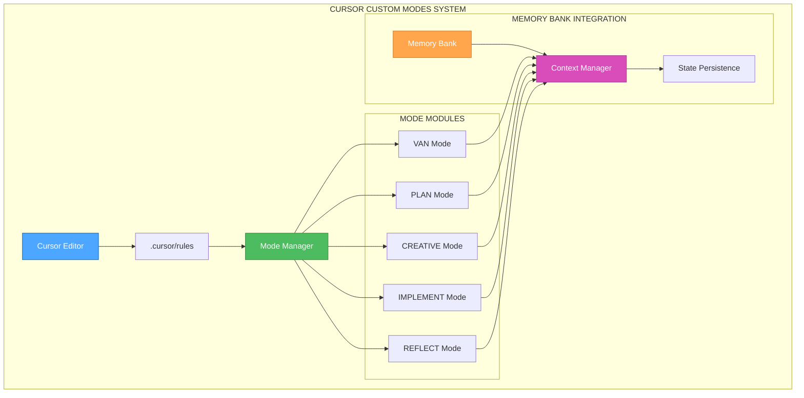
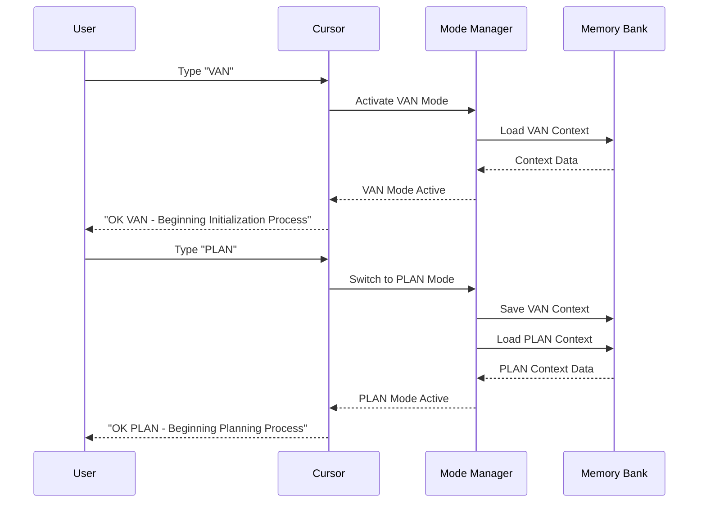
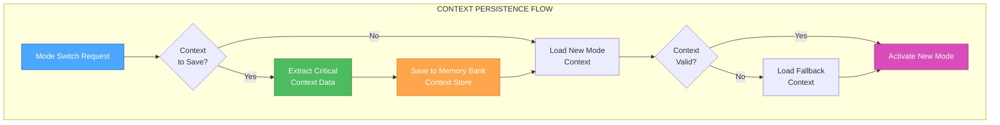
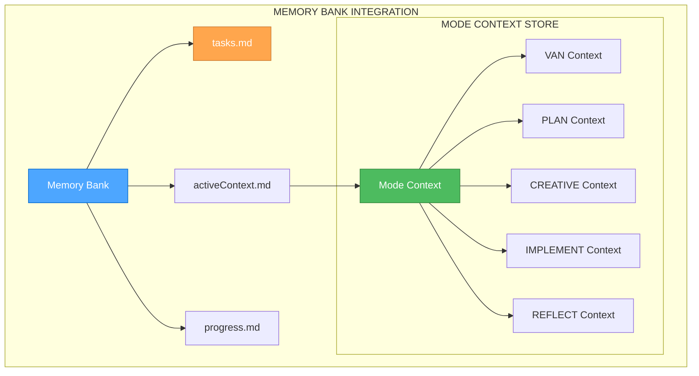

# Creative Phase: Дизайн-решения для пользовательских режимов Cursor

## 🎯 Контекст задачи
**Задача**: Настройка 5 пользовательских режимов в Cursor с полной интеграцией Memory Bank системы
**Сложность**: Level 2 (Simple Enhancement)
**Режим**: CREATIVE (Design Phase)

## 🏗️ Архитектурные решения

### 1. Архитектура интеграции режимов

**Выбранное решение**: Модульная архитектура
**Обоснование**: Обеспечивает лучшую гибкость, простоту тестирования и изоляцию ошибок

**Архитектурная схема**:

**Компоненты**:
- **Mode Manager**: Центральный координатор режимов
- **Mode Modules**: Независимые модули каждого режима
- **Context Manager**: Управление контекстом между режимами
- **State Persistence**: Сохранение состояния в Memory Bank

### 2. UI/UX для переключения режимов

**Выбранное решение**: Текстовые команды
**Обоснование**: Оптимально для Level 2 задачи, простота реализации, высокая эффективность

**Схема переключения**:

**Команды режимов**:
- `VAN` → Активация режима инициализации
- `PLAN` → Активация режима планирования
- `CREATIVE` → Активация режима дизайна
- `IMPLEMENT` → Активация режима реализации
- `REFLECT` → Активация режима рефлексии

### 3. Алгоритм сохранения контекста

**Выбранное решение**: Селективное сохранение контекста
**Обоснование**: Оптимальный баланс между функциональностью и простотой

**Схема сохранения контекста**:

**Критический контекст для сохранения**:
- **Текущая задача**: ID и статус
- **Режим**: Активный режим и его состояние
- **Прогресс**: Выполненные этапы
- **Ресурсы**: Ссылки на важные файлы и данные
- **Настройки**: Пользовательские предпочтения

## 🔄 Интеграция с Memory Bank

### Структура интеграции

### Файлы интеграции
- **tasks.md**: Основной источник истины для задач
- **activeContext.md**: Активный контекст и состояние
- **progress.md**: Прогресс выполнения
- **creative/mode-contexts.md**: Контексты каждого режима

## 🧪 Техническая реализация

### Компоненты реализации
1. **Mode Manager**: Центральный координатор
2. **Context Extractor**: Извлечение критического контекста
3. **State Persistence**: Сохранение состояния
4. **Mode Activator**: Активация режимов
5. **Context Validator**: Валидация контекста

### Алгоритмы
- **Context Extraction Algorithm**: Извлечение важных данных
- **State Persistence Algorithm**: Сохранение в Memory Bank
- **Mode Switching Algorithm**: Переключение между режимами
- **Context Recovery Algorithm**: Восстановление контекста

## ✅ Валидация решений

### Требования выполнены
- [x] **5 пользовательских режимов**: Архитектура поддерживает все режимы
- [x] **Интеграция с Memory Bank**: Полная интеграция через Context Manager
- [x] **Автоматическое переключение**: Mode Manager обеспечивает переключение
- [x] **Сохранение контекста**: Селективное сохранение критического контекста
- [x] **Поддержка Windows**: Архитектура платформо-независима

### Техническая осуществимость
- [x] **Простота реализации**: Модульная архитектура упрощает разработку
- [x] **Тестируемость**: Каждый модуль можно тестировать независимо
- [x] **Масштабируемость**: Легко добавлять новые режимы
- [x] **Производительность**: Эффективные алгоритмы сохранения контекста

## 🎯 Следующие шаги

1. **Перейти к IMPLEMENT режиму** для реализации
2. **Реализовать Mode Manager** как центральный компонент
3. **Создать Context Extractor** для извлечения контекста
4. **Реализовать State Persistence** для сохранения состояния
5. **Интегрировать с существующими правилами** Cursor

## 📊 Метрики дизайна

- **Архитектурная сложность**: Низкая (Level 2)
- **Интеграционная сложность**: Средняя
- **UI/UX сложность**: Низкая (текстовые команды)
- **Алгоритмическая сложность**: Средняя
- **Общая сложность**: Соответствует Level 2

**Вывод**: Дизайн-решения оптимальны для Level 2 задачи и обеспечивают эффективную реализацию системы пользовательских режимов Cursor.
