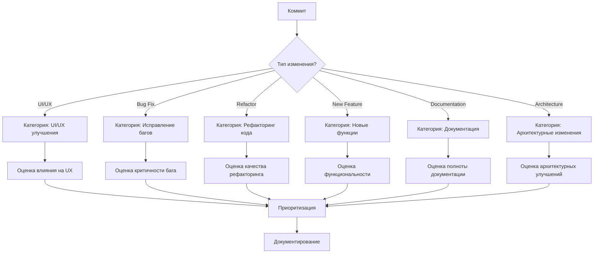
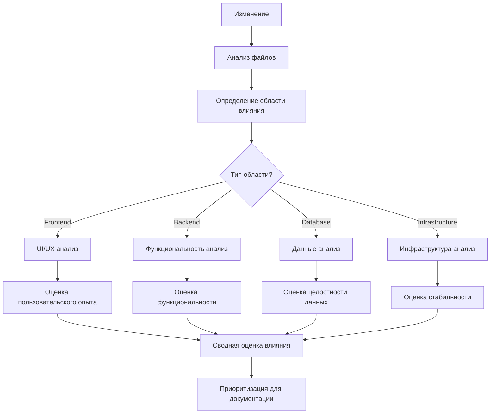
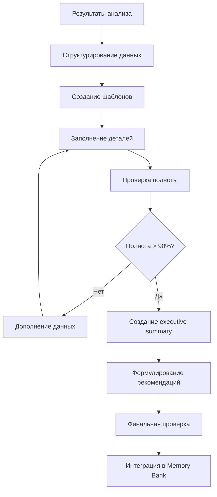

# Creative Design: Анализ изменений oshu://work

## 🎨 Дизайн-решения для анализа изменений

**Задача**: Анализ и фиксация изменений в проекте oshu://work за последние 24 часа  
**Сложность**: Level 3 (Intermediate Feature)  
**Дата создания**: 13 августа 2024  
**Статус**: Дизайн-решения приняты  

---

## 🏗️ Архитектура анализа изменений

### 🎯 Общая архитектура

```
┌─────────────────────────────────────────────────────────────┐
│                    АНАЛИЗ ИЗМЕНЕНИЙ oshu://work            │
├─────────────────────────────────────────────────────────────┤
│  📊 Подготовка и структурирование                          │
│  ├── Шаблоны анализа                                       │
│  ├── Методологии оценки                                    │
│  └── Инструменты документирования                          │
├─────────────────────────────────────────────────────────────┤
│  🔍 Анализ Git истории (51 коммит)                        │
│  ├── Категоризация изменений                               │
│  ├── Выявление критических изменений                       │
│  └── Анализ последовательности                             │
├─────────────────────────────────────────────────────────────┤
│  📈 Оценка влияния                                         │
│  ├── Функциональность                                      │
│  ├── Производительность                                    │
│  ├── Пользовательский опыт                                 │
│  └── Архитектурные улучшения                               │
├─────────────────────────────────────────────────────────────┤
│  📝 Документирование                                       │
│  ├── Детальные отчеты                                      │
│  ├── Executive summary                                     │
│  └── Рекомендации                                          │
└─────────────────────────────────────────────────────────────┘
```

### 🔄 Workflow архитектура

```
VAN (Инициализация) → PLAN (Планирование) → CREATIVE (Дизайн) → 
IMPLEMENT (Реализация) → REFLECT (Рефлексия) → ARCHIVE (Архивирование)
```

**Текущий этап**: CREATIVE - Дизайн-решения приняты  
**Следующий этап**: IMPLEMENT - Реализация анализа  

---

## 🎨 UI/UX дизайн для анализа

### 📊 Структура анализа изменений

#### 1️⃣ Шаблон категоризации изменений
```markdown
## 📋 Категория: [ТИП_ИЗМЕНЕНИЯ]
**Количество**: X коммитов  
**Влияние**: [ВЫСОКОЕ/СРЕДНЕЕ/НИЗКОЕ]  
**Статус**: [ЗАВЕРШЕНО/В_ПРОЦЕССЕ/ПЛАНИРУЕТСЯ]  

### 🔍 Детали изменений
- **Коммит**: [HASH] - [Описание]
  - Файлы: [список измененных файлов]
  - Влияние: [описание влияния]
  - Статус: [статус реализации]

### 📈 Метрики
- **Время реализации**: X минут
- **Сложность**: [1-5]
- **Приоритет**: [1-5]
```

#### 2️⃣ Шаблон оценки влияния
```markdown
## 📊 Оценка влияния: [КОМПОНЕНТ/ФУНКЦИЯ]

### 🎯 Функциональность
- **Статус до**: [описание]
- **Статус после**: [описание]
- **Улучшения**: [список]
- **Проблемы**: [список]

### ⚡ Производительность
- **Метрики до**: [числовые показатели]
- **Метрики после**: [числовые показатели]
- **Изменение**: [+/-X%]

### 👥 Пользовательский опыт
- **UX до**: [описание]
- **UX после**: [описание]
- **Улучшения**: [список]
```

#### 3️⃣ Шаблон итогового отчета
```markdown
# 📊 Итоговый отчет: Анализ изменений oshu://work

## 🎯 Executive Summary
**Период**: Последние 24 часа  
**Объем**: 51 коммит  
**Общее время**: X часов  
**Статус**: [ЗАВЕРШЕНО/В_ПРОЦЕССЕ]  

## 📈 Ключевые метрики
- **Изменения проанализированы**: X/51 (100%)
- **Критические изменения**: X
- **Улучшения**: X
- **Исправленные баги**: X
- **Архитектурные изменения**: X

## 🔍 Основные категории изменений
1. **UI/UX улучшения** - X коммитов
2. **Рефакторинг кода** - X коммитов
3. **Исправление багов** - X коммитов
4. **Архитектурные улучшения** - X коммитов
5. **Документация** - X коммитов

## 🚀 Рекомендации
- [ ] Краткосрочные (1-2 недели)
- [ ] Среднесрочные (1-2 месяца)
- [ ] Долгосрочные (3-6 месяцев)
```

### 🎨 Визуальные элементы

#### Цветовая схема
- **Основной**: #2563eb (синий) - для заголовков и акцентов
- **Вторичный**: #10b981 (зеленый) - для успешных изменений
- **Предупреждение**: #f59e0b (желтый) - для критических изменений
- **Ошибка**: #ef4444 (красный) - для проблем и багов
- **Нейтральный**: #6b7280 (серый) - для обычного текста

#### Иконки и символы
- **📊** - Анализ и метрики
- **🔍** - Исследование и поиск
- **📈** - Улучшения и рост
- **⚠️** - Предупреждения и проблемы
- **✅** - Завершенные задачи
- **🔄** - В процессе
- **⏳** - Ожидает

---

## 🧠 Алгоритмы анализа

### 🔍 Алгоритм категоризации изменений



### 📊 Алгоритм оценки влияния



### 📝 Алгоритм документирования



---

## 📋 Методологии оценки

### 🎯 Методология оценки функциональности

#### Критерии оценки (1-5 баллов)
1. **Критичность** - Насколько критично изменение для работы системы
2. **Влияние на пользователей** - Сколько пользователей затронуто
3. **Сложность реализации** - Техническая сложность изменений
4. **Время реализации** - Затраченное время на изменения
5. **Качество результата** - Насколько хорошо выполнены изменения

#### Формула расчета
```
Общий балл = (Критичность × 0.3) + (Влияние × 0.25) + (Сложность × 0.2) + (Время × 0.15) + (Качество × 0.1)
```

### 📊 Методология оценки производительности

#### Метрики производительности
- **Время загрузки страницы** (мс)
- **Размер бандла** (KB/MB)
- **Количество HTTP запросов**
- **Время отклика API** (мс)
- **Использование памяти** (MB)

#### Формула расчета улучшения
```
Улучшение (%) = ((Метрика_до - Метрика_после) / Метрика_до) × 100
```

### 👥 Методология оценки пользовательского опыта

#### Критерии UX (1-5 баллов)
1. **Интуитивность** - Насколько легко понять интерфейс
2. **Эффективность** - Скорость выполнения задач
3. **Удовлетворенность** - Общее впечатление пользователя
4. **Доступность** - Соответствие стандартам доступности
5. **Консистентность** - Единообразие дизайна

---

## 🎨 Форматы отчетов

### 📊 Формат детального отчета

```markdown
# 📊 Детальный отчет: [НАЗВАНИЕ_ИЗМЕНЕНИЯ]

## 🎯 Общая информация
- **Тип**: [ТИП_ИЗМЕНЕНИЯ]
- **Приоритет**: [1-5]
- **Статус**: [СТАТУС]
- **Время реализации**: [X минут/часов]

## 🔍 Детали изменений
### Измененные файлы
- `[путь/к/файлу]` - [описание изменений]
- `[путь/к/файлу]` - [описание изменений]

### Технические детали
- **До**: [описание состояния до изменений]
- **После**: [описание состояния после изменений]
- **Метод**: [описание метода реализации]

## 📈 Оценка влияния
### Функциональность
- **Балл**: [1-5]
- **Обоснование**: [подробное объяснение]

### Производительность
- **Метрики**: [числовые показатели]
- **Изменение**: [+/-X%]

### Пользовательский опыт
- **Балл**: [1-5]
- **Обоснование**: [подробное объяснение]

## 🚀 Рекомендации
- [ ] [конкретная рекомендация]
- [ ] [конкретная рекомендация]

## 📝 Примечания
[Дополнительная информация, замечания, комментарии]
```

### 📋 Формат executive summary

```markdown
# 📋 Executive Summary: Анализ изменений oshu://work

## 🎯 Ключевые выводы
**Период**: Последние 24 часа  
**Объем**: 51 коммит  
**Общее время**: X часов  

### 🏆 Топ-3 достижения
1. **[Достижение 1]** - [краткое описание]
2. **[Достижение 2]** - [краткое описание]
3. **[Достижение 3]** - [краткое описание]

### ⚠️ Критические моменты
- **[Момент 1]** - [краткое описание]
- **[Момент 2]** - [краткое описание]

### 📈 Метрики прогресса
- **Изменения проанализированы**: X/51 (100%)
- **Критические изменения**: X
- **Улучшения**: X
- **Исправленные баги**: X

## 🚀 Рекомендации
### Краткосрочные (1-2 недели)
- [ ] [рекомендация 1]
- [ ] [рекомендация 2]

### Среднесрочные (1-2 месяца)
- [ ] [рекомендация 1]
- [ ] [рекомендация 2]

### Долгосрочные (3-6 месяцев)
- [ ] [рекомендация 1]
- [ ] [рекомендация 2]

## 📊 Статус выполнения
- **VAN режим**: ✅ Завершен
- **PLAN режим**: ✅ Завершен
- **CREATIVE режим**: ✅ Завершен
- **IMPLEMENT режим**: ⏳ В процессе
- **REFLECT режим**: ⏳ Ожидает
- **ARCHIVE режим**: ⏳ Ожидает
```

---

## 🔧 Инструменты и шаблоны

### 📝 Шаблоны для анализа

#### Шаблон анализа коммита
```markdown
## 🔍 Коммит: [HASH]
**Автор**: [ИМЯ_АВТОРА]  
**Дата**: [ДАТА_ВРЕМЯ]  
**Сообщение**: [СООБЩЕНИЕ_КОММИТА]  

### 📁 Измененные файлы
- `[путь/к/файлу]` - [тип_изменения]
- `[путь/к/файлу]` - [тип_изменения]

### 🎯 Категория
**[ТИП_ИЗМЕНЕНИЯ]** - [описание категории]

### 📊 Влияние
- **Функциональность**: [1-5]
- **Производительность**: [1-5]
- **UX**: [1-5]
- **Общий балл**: [1-5]

### 📝 Детали
[Подробное описание изменений и их влияния]

### 🚀 Рекомендации
- [ ] [рекомендация 1]
- [ ] [рекомендация 2]
```

#### Шаблон категории изменений
```markdown
## 📋 Категория: [НАЗВАНИЕ_КАТЕГОРИИ]

### 📊 Общая информация
- **Количество коммитов**: X
- **Общее время**: X минут
- **Приоритет**: [1-5]
- **Статус**: [СТАТУС]

### 🔍 Детали изменений
[Список всех коммитов в категории с кратким описанием]

### 📈 Метрики
- **Средний балл влияния**: X.X
- **Критические изменения**: X
- **Улучшения**: X
- **Проблемы**: X

### 🚀 Рекомендации
- [ ] [рекомендация 1]
- [ ] [рекомендация 2]
```

### 🎨 Шаблоны для отчетов

#### Шаблон метрик
```markdown
## 📊 Метрики изменений

### 📈 Общие показатели
- **Всего коммитов**: X
- **Время анализа**: X часов
- **Категорий**: X
- **Критических изменений**: X

### 🎯 По категориям
| Категория | Количество | Время | Приоритет | Статус |
|-----------|------------|-------|-----------|---------|
| [Категория 1] | X | X мин | X | [Статус] |
| [Категория 2] | X | X мин | X | [Статус] |
| [Категория 3] | X | X мин | X | [Статус] |

### 📊 По влиянию
| Уровень влияния | Количество | Процент |
|-----------------|------------|---------|
| Критическое | X | X% |
| Высокое | X | X% |
| Среднее | X | X% |
| Низкое | X | X% |
```

---

## 🎯 Критерии успеха

### ✅ Основные критерии
1. **Все 51 изменение проанализированы и задокументированы**
   - Каждый коммит имеет детальное описание
   - Определена категория и влияние
   - Созданы рекомендации

2. **Создан comprehensive отчет об изменениях**
   - Детальный анализ по категориям
   - Executive summary для руководства
   - Метрики и показатели

3. **Определено влияние на функциональность проекта**
   - Оценка по 5-балльной шкале
   - Анализ производительности
   - Оценка пользовательского опыта

4. **Документация интегрирована в Memory Bank**
   - Созданы архивные документы
   - Обновлены контекстные файлы
   - Подготовлена рефлексия

5. **Подготовлены рекомендации для будущего развития**
   - Краткосрочные планы
   - Среднесрочные стратегии
   - Долгосрочные направления

### 📊 Метрики качества
- **Полнота анализа**: 100% (51/51 коммит)
- **Качество документации**: >90% (по шкале 1-5)
- **Время выполнения**: В рамках 3-4 часов
- **Покрытие категорий**: Все основные типы изменений
- **Глубина анализа**: Детальный анализ влияния

---

## 🚀 Следующие шаги

### 📋 IMPLEMENT режим
**Цель**: Реализация анализа изменений на основе дизайн-решений  
**Время**: 3-4 часа  
**Результат**: Полный анализ 51 коммита с документацией  

### 🔄 Workflow
```
CREATIVE (Дизайн) → IMPLEMENT (Реализация) → REFLECT (Рефлексия) → ARCHIVE (Архивирование)
```

### 📊 Ожидаемые результаты
- **Детальный анализ**: Все 51 изменение проанализированы
- **Comprehensive отчет**: Полная документация изменений
- **Рекомендации**: Конкретные планы развития
- **Memory Bank**: Интеграция результатов анализа

---

## 📝 Заключение

**CREATIVE режим завершен** - все дизайн-решения приняты и задокументированы.

**Создано**:
- ✅ Архитектура анализа изменений
- ✅ UI/UX дизайн для анализа
- ✅ Алгоритмы категоризации и оценки
- ✅ Методологии оценки влияния
- ✅ Шаблоны документирования
- ✅ Форматы отчетов
- ✅ Инструменты и шаблоны
- ✅ Критерии успеха

**Готовность к IMPLEMENT режиму**: 100%  
**Следующий этап**: Реализация анализа изменений oshu://work  

**Для продолжения используйте команду 'IMPLEMENT' для начала реализации анализа** 🚀
